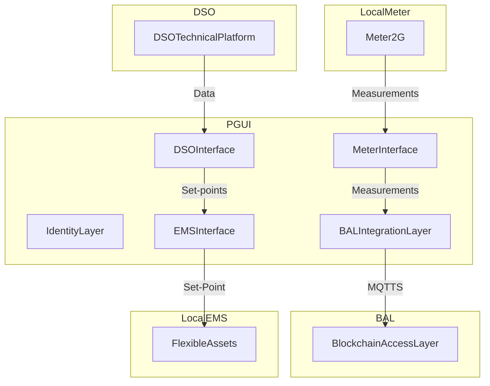

# PGUI

## Introduction
PGUI (Power Grid User Interface) is a **Specification** for implementing software interfaces for edge devices capable providing data exchange and edge functionalities required to enable ancillary services between grid operators (TSOs, DSOs and BSPs) and the distributed energy resource owner.

## Objectives
The main objective of the PGUI is to make the signed, correct measurements available to the network operators with adequate timing for the monitoring and management of the Distributed Resources.

## Architecture
The main components of the PGUI Framework are

- Identity Layer
- Meter Interface
- EMS Interface
- BAL Integration
- DSO Technical Platform Integration

### Identity Layer

### Meter Interface

### EMS Interface

### BAL Integration Layer
