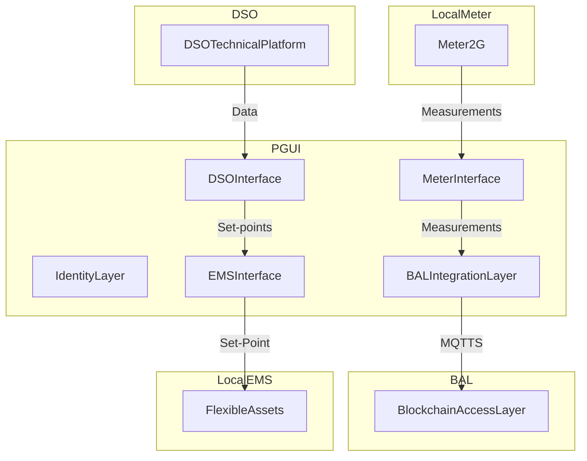

# PGUI

## Introduction
PGUI (Power Grid User Interface) is a **Specification** for implementing software interfaces for edge devices capable providing data exchange and edge functionalities required to enable ancillary services between grid operators (TSOs, DSOs and BSPs) and the distributed energy resource owner.

## Objectives
The main objective of the PGUI is to make the signed, correct measurements available to the network operators with adequate timing for the monitoring and management of the Distributed Resources.

## Architecture
The main components of the PGUI Framework are

- **Identity Layer**: It provides the software components required to handle cryptographic keys and signature functions
- **Meter Interface**: It provides abstractions and implementations to interact with the main meter through several physical protocols, depending on the underlying hardware.
- **EMS Interface**: It provides abstractions and implementations to interact with local EMS/BEMS.
- **BAL Integration**: It provides the software components required to handle the two way communication with the Blockchain Access Layer.
- **DSO Technical Platform Integration**: It provides the software components required to handle the communication with the DSO, which main purpose is to receive Set-Points.

### Hardware Requirements

In order to successfuly run the the software components described above, there are some minimum requirements that the hardware platform should satisfy. Due to the nature of the environment in which the PGUI operates, these requirements may vary depending on several factors, mainly on the kind of field devices that must be interfaced.

- The hardware platform (the device) MUST be able to establish a MQTTs connection with the Blockchain Access Layer MQTT Broker. This connection MUST allow the successful communication of all the information described in this document within reasonable time.
- The hardware platform (the device) MUST be able to establish a MQTTs connection with the DSO Technical Platform MQTT Broker
- The hardware platform (the device) MUST be able to establish a local connection with the Main Meter (wired or wireless depending on the technology of the Main Meter)
- The hardware platform (the device) MUST be able to establish a local connection with the local EMS/BMS (wired or wireless depending on the technology of the EMS/BMS). This connection MUST consent the communication of the setpoints from the PGUI to the EMS/BMS. The connection SHOULD also allow the EMS/BMS to gather measurements from the PGUI.
- The hardware platform (the device) MUST be able to store data that should be sent to the Blockchain Access Layer for a period of at least 48 hours, in order to preserve data in case of network partitions between the PGUI and the BAL.

### Identity Layer

At startup, the PGUI register itself with the Blockchain Access Layer, creating a MQTT connection to the remote broker. In order to connect to the broker, the PGUI must provide valid **BAL credentials**, which are managed by the identity layer. Only after this connection and authentication is established, the PGUI will be able to forward measurements to the BAL.

Furthermore, each PGUI keeps a pair of cryptographic keys: each group of measurements registered by the PGUI, before being forwared to the Blockchain Access Layer (BAL) through the BAL interface, is **signed** with the private key which is unique to each PGUI. This signature will be then verified by the BAL, before notarizing field measurements.

Both credentials should be rotated priodically.

### Meter Interface

The PGUI is designed to be connected to the main meter in order to gather all the required electric measurements to sign and forward to the BAL. The meter interface defines a standard data structure that several concrete implementations of the interface can implement in order to keep compatibility with Blockchain Access Layer.

### EMS Interface

The EMS interface is the component dedicated to the communication with the local Energy Management System. Its main purpose is to share the Set-Point that the EMS should handle.

The Interface exposes only the Set-Point corresponding to the current TimeSlot 

**Modbus TCP Interface**

- Host: PGUI IP
- Port: 8502

| Address | Field Name | Description |
| ----- | ----- | -------- |
| 1000 | bspP Current   | Current Active Power Setpoint |
| 1100 | bspP Next   | Next Active Power Setpoint |
| 2000 | bspQ Current  | Current Reactive Power Setpoint |
| 2100 | bspQ Next   | Next Reactive Power Setpoint |

**HTTP Interface**

- Host: PGUI IP
- Port: 8000

| Method | URL | Description |
| ----- | ----- | -------- |
| GET | http://<PGUI_IP>:8000   | If a setpoint is present the statusCode is 200 and the response body is in the form `{"bspP":100,"bspQ":100}`. If no setpoint is available, the status code is 404. |
  

### BAL Integration Layer
