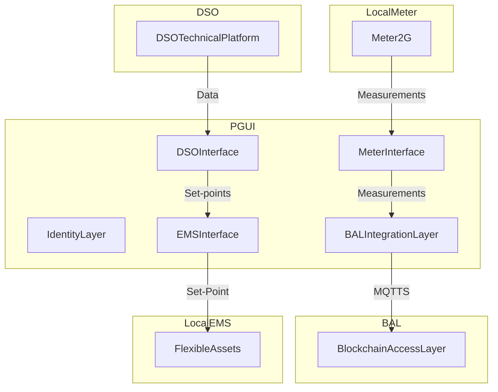

# PGUI

## Introduction
PGUI (Power Grid User Interface) is a **Specification** for implementing software interfaces for edge devices capable providing data exchange and edge functionalities required to enable ancillary services between grid operators (TSOs, DSOs and BSPs) and the distributed energy resource owner.

## Objectives
The main objective of the PGUI is to make the signed, correct measurements available to the network operators with adequate timing for the monitoring and management of the Distributed Resources.

## Architecture
The main components of the PGUI Framework are

- Identity Layer
- Meter Interface
- EMS Interface
- BAL Integration
- DSO Technical Platform Integration

### Identity Layer

### Meter Interface

### EMS Interface

The EMS interface is the component dedicated to the communication with the local Energy Management System. Its main purpose is to share the Set-Point that the EMS should handle.

The Interface exposes only the Set-Point corresponding to the current TimeSlot 

**Modbus TCP Interface**

Host: PGUI IP
Port: 8502

| Address | Field Name | Description |
| ----- | ----- | -------- |
| 1000 | bspP   | Active Power Setpoint |
| 2000 | bspQ   | Reactive Power Setpoint |

**HTTP Interface**

Host: PGUI IP
Port: 8000

| Method | URL | Description |
| ----- | ----- | -------- |
| GET | http://<PGUI_IP>:8000   | If a setpoint is present the statusCode is 200 and the response body is in the form `{"bspP":100,"bspQ":100}`. If no setpoint is available, the status code is 404. |
  

### BAL Integration Layer
